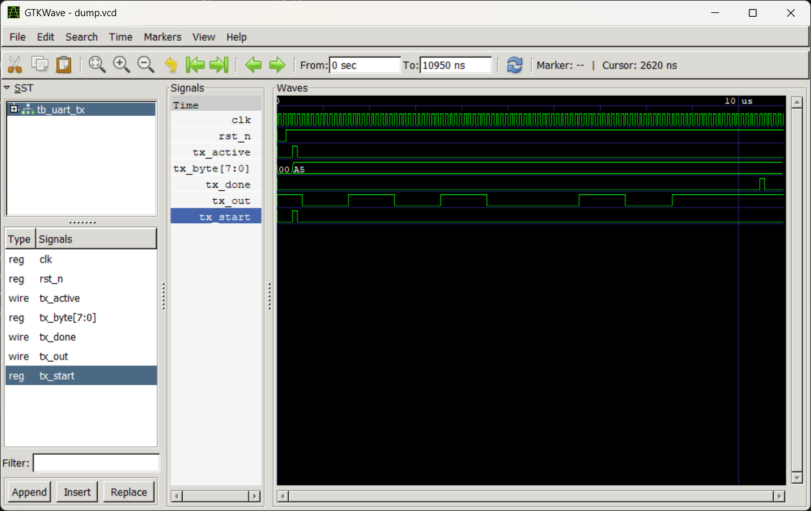

# UART Transmitter (Verilog)

A simple UART transmitter module written in Verilog. Takes an 8-bit byte and sends it out serially with a start bit, 8 data bits (LSB first), and a stop bit - standard async UART framing.

## What it does

- Sends 1 start bit, 8 data bits, 1 stop bit (no parity)
- Baud rate and clock frequency are both parameterized, so you can plug in whatever values match your setup
- `tx_active` goes high while a byte is being sent, `tx_done` pulses once it's finished

## Files

| File | Description |
|------|--------------|
| `uart_tx.v` | The UART TX module (design) |
| `tb_uart_tx.v` | Testbench - sends a test byte (`8'hA5`) and checks the output |

## How it works

The module is a simple 4-state FSM: `IDLE -> START -> DATA -> STOP -> IDLE`.

A counter (`clk_count`) tracks how many clock cycles have passed within the current bit, and switches state once it hits `CLK_PER_BIT - 1`. `CLK_PER_BIT` is just `CLK_FREQ / BAUD_RATE`, calculated automatically from the parameters.

In the DATA state, `bit_index` walks through the byte from bit 0 to bit 7 (LSB first), one bit sent per baud period.

## Simulating

Used Icarus Verilog + GTKWave for this.

```bash
iverilog -o uart_tx_sim uart_tx.v tb_uart_tx.v
vvp uart_tx_sim
```

To view the waveform, add a `$dumpfile`/`$dumpvars` in the testbench (or use your own), then:

```bash
gtkwave uart_tx.vcd
```

## Test case

Testbench sends `8'hA5` (`1010 0101`) and expects this on `tx_out`:

```
START(0) -> D0(1) -> D1(0) -> D2(1) -> D3(0) -> D4(0) -> D5(1) -> D6(0) -> D7(1) -> STOP(1)
```

Note: for simulation the clock/baud values are overridden to 10 MHz / 1 Mbps (10 cycles per bit) just so the waveform doesn't take forever to look at. Real-world values (e.g. 50 MHz / 115200) would just mean more clock cycles per bit, same logic.

## Waveform



Captured in GTKWave - shows `tx_out` going through START -> D0 to D7 -> STOP while sending `8'hA5`. `tx_active` stays high for the whole transfer, `tx_done` pulses right at the end.

## Possible next steps

- Add a UART receiver (`uart_rx`) to make it a full duplex module
- Add parity bit support
- Wrap both TX/RX into a top-level UART core with FIFO buffers
